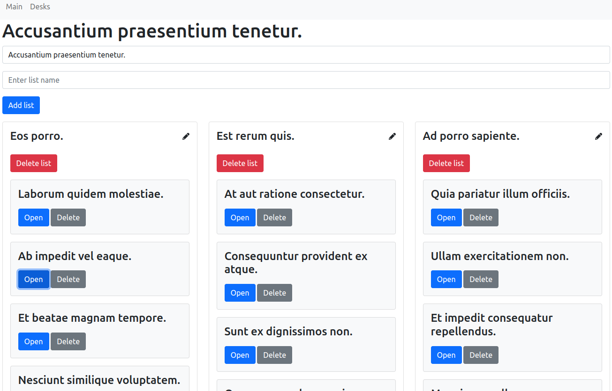
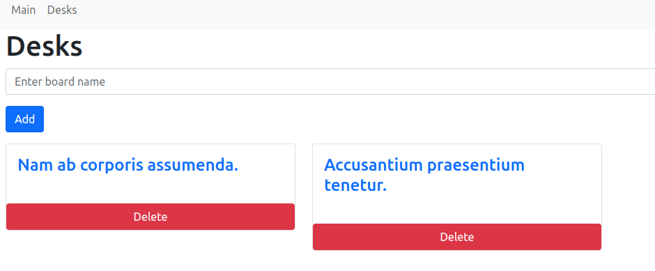
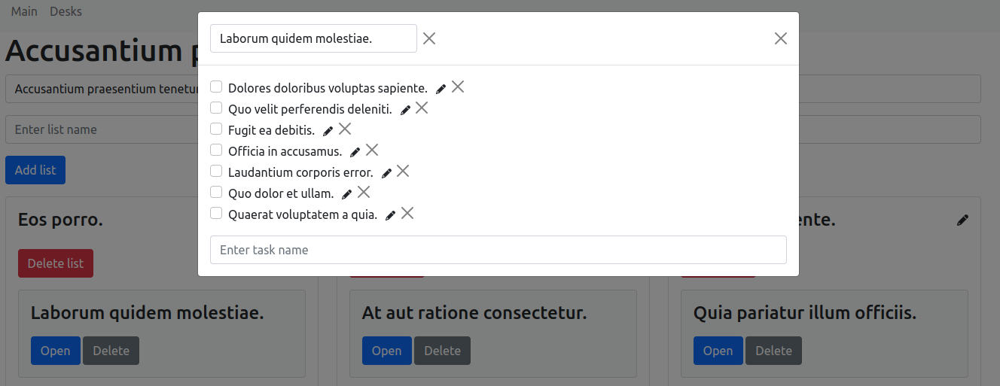

## SPA application for planning tasks.

In the application, you can add a desktop, for example, it will be some kind of project.  Each desktop has lists, for example this is a subproject.

The list has cards, for example, this is some kind of task. The card has tasks.
Every desktop, list, card, task is added, edited and deleted from one page.

The application is written using Laravel and Vue.js frameworks

## Installation.

Clone the application with Git command: git clone https://github.com/ArtemIshchenko/laravel-spa-app.git.

Configure the server and create the database.

Update vendors via composer: php composer.phar install.

Migrate to the database: php artisan migrate.

Running Seeders: php artisan db:seed.

The application is ready to use.